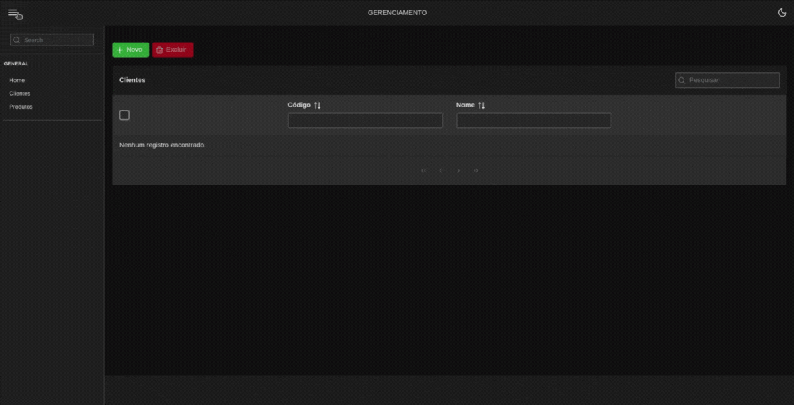
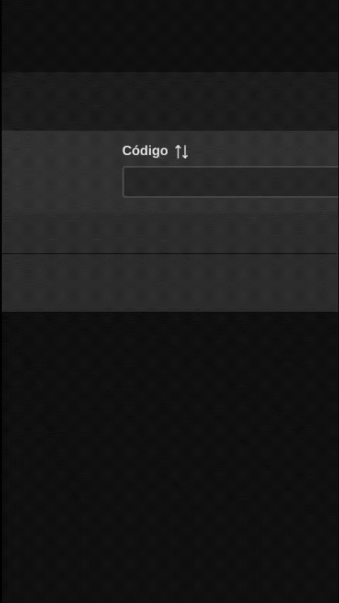

<br />
<div align="center" id="top">
  <a href="https://linkedin.com/in/ldnovaes">
    
  </a>

  <h3 align="center">Projeto JSF para Gerenciamento de Vendas</h3>

  <p align="center">
    Um projetinho para aprimoramento do meu conhecimento com JavaServer Faces. Esse projeto implementa tecnologias primordiais para funcionamento de uma aplicação JSF, como também utiliza Design Patterns e princípios SOLID para um código fluído e limpo. 
    <br />
    <br />
  </p>
</div>


<!-- TABLE OF CONTENTS -->
<details>
  <summary>Conteúdo</summary>
  <ol>
    <li>
      <a href="#sobre">Sobre o Projeto</a>
      <ul>
        <li><a href="#ferramentas">Ferramentas Utilizadas</a></li>
      </ul>
    </li>
    <li>
      <a href="#comeco">Começando</a>
      <ul>
        <li><a href="#requisitos">Requisitos</a></li>
        <li><a href="#deploy">Deploy</a></li>
      </ul>
    </li>
    <li><a href="#uso">Usando</a></li>
    <li><a href="#licenca">Licença</a></li>
    <li><a href="#contato">Contato</a></li>
  </ol>
</details>


<!-- ABOUT THE PROJECT -->
## <span id="sobre">Sobre o Projeto</span>

Trata-se de um projeto com fins didático onde foi possível utilizar o JSF para sua construção. O intuito era adquirir experiência e conhecimento com projetos monolíticos de forma que futuros desafios sejam encarados de maneira profissional e objetiva. O projeto é responsível e tem opções dark/light para escolha do usuário. Veja abaixo:

#### Projeto no Computador
<p align="center">
    
</p>

#### Projeto no Celular
<p align="center">
    
</p>

<p align="right">(<a href="#top">Topo</a>)</p>


### <span id="ferramentas">Ferramentas Utilizadas</span>

* 
* 
* 

<p align="right">(<a href="#top">Topo</a>)</p>


## <span id="comeco">Começando</span>

Assumindo que você tenha as ferramentas supracitadas, aqui daremos início ao projeto. Por se tratar de um projeto Web você poderá acessá-lo direto do seu navegador.

#### <span id="requisitos">Requisitos</span>

Primeiro, é preciso ter o projeto em uma pasta separada em seu computador. Clone o repositório nesse local escolhido:

```sh
git clone https://github.com/ldnovaes/vendas-online-jsf.git
```

#### <span id="deploy">Deploy</span>

O projeto foi construído para rodar em um container docker. Ele é auto-implantável. Com isso, com apenas um comando você terá o projeto rodando em sua máquina sem maiores dores de cabeça. Usando um terminal na raiz do projeto, digite:

```sh
docker-compose up -d
```

O argumento `-d` permite a execução do container mesmo que o seu terminal esteja fechado.

Feito isso, o projeto poderá ser executado com <a href="http://localhost:8089/gerenciamento-loja/">http://localhost:8089/gerenciamento-loja/</a>

<p align="right">(<a href="#top">Topo</a>)</p>


## <span id="uso">Usando</span>

Esse projeto consite em manusear vendas de forma rápida e prática. Para tal é necessário que se tenha cadastrado previamente o Cliente e os Produtos que estão disponibilizados para a venda. Conta-se com algumas facilidades durante esse cadastro. O CEP no cadastro do cliente é totalmente opcional, porém se você digitar o CEP corretamente, é feito uma requisição em uma API que devolverá os dados de Rua, Bairro, Cidade e Estado. Com isso, ganha-se tempo e produtividade na hora de realizar os cadastros.

Já na página de cadastro de venda, de acordo com o que é digitado no campo `Produto` e `Cliente` o sistema é capaz de pesquisar através desses nomes para endereçar o Cliente e o Produto à Venda de forma automática.
<p align="right">(<a href="#top">Topo</a>)</p>

## <span id="uso">Entendendo o Projeto</span>

Esse projeto trabalha com modelo de classes genéricas que pode ser implementada por muitas outras sem afetar o seu funcionamento. Isso possibilita um melhor reaproveitamento de códigos. Um exemplo disso é um GenericDAO que é capaz de resolver qualquer CRUD independente de qual entity estamos trabalhando. Dessa forma, se uma entity não precisa ter métodos personalizados, o GenericDAO deve ser suficiente para atender seus problemas.
Também deve-se notar que usa-se muito de anotações para resolver problemas em RUNTIME. Caso for contribuir, não esqueça de ler a documentação referente ao projeto.
<p align="right">(<a href="#top">Topo</a>)</p>

## <span id="licenca">Licença</span>

Distribuído sob a licença GNU. Veja `LICENSE.txt` para mais informações.

<p align="right">(<a href="#top">Topo</a>)</p>


## <span id="contato">Contato</span>

* Hotmail - [Envie-me um email](leandroduarte2012@hotmail.com)
* Linkedin - [Envie-me uma DM](https://linkedin.com/in/ldnovaes)


<p align="right">(<a href="#top">Topo</a>)</p>

